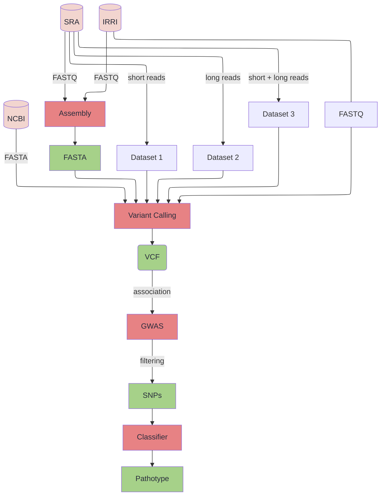
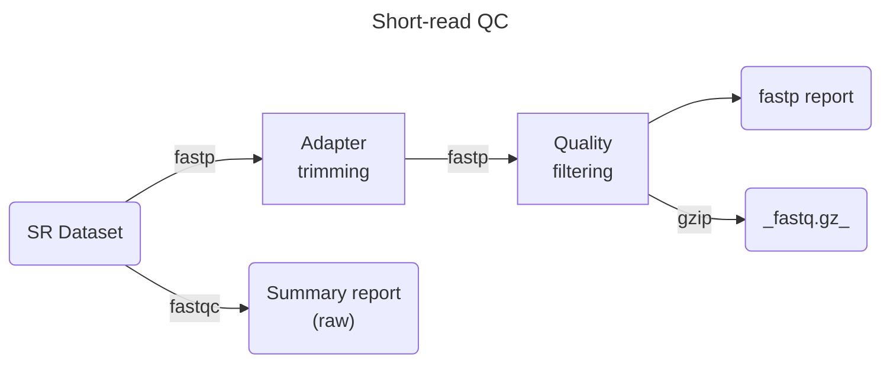
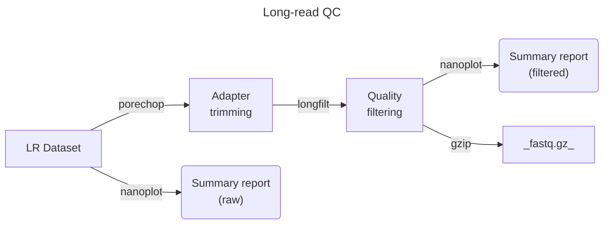
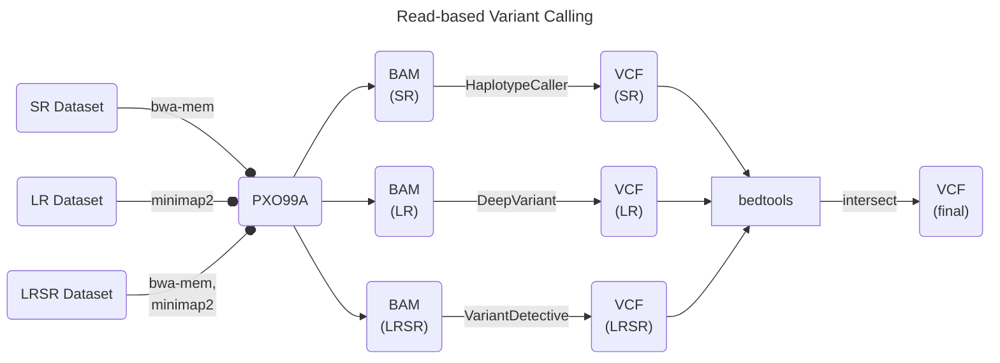
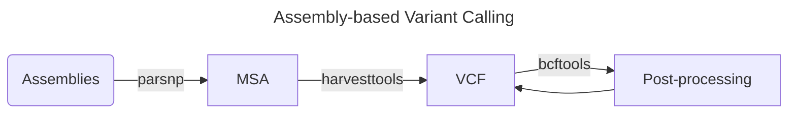

## Overview

**Title**: A machine-learning model for TALome-based prediction of _Xanthomonas oryzae_ pv. _oryzae_ (Xoo) pathotype

**Research Venue**: Plant Pathology Department, International Rice Research Institute (IRRI)

**Advisers**:
- Dr. John Justine Villar, Department of Computer Science
- Dr. Neil Andrew Bascos, National Institute of Molecular Biology and Biotechnology

**Coordinators**:
- Dr. Van Schepler-Luu
- Dale Pinili, M.Sc.

## Rationale

- Xoo pathotype against rice resistance (R) genes is mainly due to its inherent TALE genes
- TALE genes contain central repeat domain responsible for binding with specific motifs (i.e. EBEs) in host promoter
    - modules host gene expression to benefir its own growth
- Recent phylogenomic analysis showed specific Xoo population susceptible to specific Xa (R) genes
- **Pathotyping of Xoo is costly and takes a long time**
    - heavy on wet lab procedures (i.e., bacterial isolation, NIL inoculation, resistance evaluation)
 
:::{.callout-note} 
Can we predict the pathotype of an isolate from sequence data alone?
:::

## Objectives

- Identify SNPs associate with eac TAL gene using GWAS
- Develop a predictive model for Xoo pathotyping
- Bundle the model as a module for IRRI's [PathoTracer 2.0](https://cgspace.cgiar.org/server/api/core/bitstreams/1947e596-3315-46c9-8fea-ceec4d5a3531/content)

## Significance

- Bypass the steps in traditional pathotyping
- Reduce cost for Xoo screening
- Guide farmer decision on deploying resistant rice varieties

:::{important}
The value of this study lies in its ability to increase pathotyping throughput which will provide rice researchers the ability to perform large-scale Xoo screening.
:::

## Approach

- Use all available Xoo long-reads and assemblies to identify SNPs
- Split into three datasets for variant calling:
    - long-reads
    - short-reads
    - long + short reads
- Perform GWAS to identify which mutations are associated with each TAL gene
- Build a matrix from the set of highly correlated SNPs
- Develop a supervised machine-learning classifier to predict pathotype
    - input: **SNP matrix**
    - output: **Pathotype classification**

```{table}
:label: snp-matrix
:align: center

|            | **SNP1** | **SNP2** | **SNP3** | **SNP4** | **SNP5** | **SNP6** | **SNP7** | **SNP8** | **SNP9** |
| :--------: | :------: | :------: | :------: | :------: | :------: | :------: | :------: | :------: | :------: |
| **Race 1** | 0 | 0 | 1 | 0 | 1 | 1 | 1 | 0 | 0 | 
| **Race 2** | 0 | 1 | 1 | 1 | 0 | 0 | 1 | 1 | 0 | 
| **Race 3** | 1 | 0 | 0 | 0 | 0 | 0 | 0 | 1 | 1 | 
| **Race 4** | 1 | 1 | 1 | 1 | 1 | 0 | 0 | 1 | 0 | 
| **Race 5** | 0 | 1 | 1 | 1 | 0 | 0 | 0 | 1 | 0 | 
| **Race 6** | 1 | 1 | 1 | 0 | 0 | 1 | 0 | 1 | 1 | 

```

## Methods



### 1. Data Curation
- download all available sequencing reads and assemblies from public databases
- download reads/assemblies generated by IRRI
- only include long-reads generated by ONT/PacBio
	- TAL genes are highly repetitive and cannot be resolved by short reads

```{mermaid}
flowchart TD
	sra[(SRA)]
	IRRI[(IRRI)]
	NCBI[(NCBI)]

	ds1("LR dataset")
	ds2("SR dataset")
	ds3("LRSR dataset")
	ds4("Assemblies")

	NCBI -- "curation" --> ds4 

	IRRI -- "long reads" --> ds1
	sra -- "long reads" --> ds1

	sra -- "short reads" --> ds2
	sra -- "long + short
		reads" --> ds3
```

### 2. Quality Control





### 3. Variant Calling
- perform variant calling on:
	- assembled genomes
	- quality-controlled sequencing reads
- filter VCF based on established criteria
- only include SNPs in filtered VCF




### 3. Genome-wide Association Studies
- use PXO99A and X11-5A *Xoo* strains as references
	-  X11-5A lacks TAL genes
- Identify and label TAL genes of reference using AnnoTALE
- Perform GWAS pipeline for each unique TAL gene
- the set of associated SNPs will be used to train the classifier

### 4. Model Building
- start with supervised and semi-supervised models
	- input -> genomic sequence (FASTA)
	- output -> pathotype prediction, annotation table
- test out different classifiers:
	- random forest
	- gradient boosting
	- support vector machine
- evaluate models based on accuracy & precision
	- ANOVA on accuracy values from 10 replicates
	- prediction sensitivity and specificity
   
### 5. Module Development
- integrate model to the PathoTracer platform
- update data ingestion pipeline to include model inference

## Software and Tools

::::{grid} 1 1 2 3

:::{card}
:header: Data Retrieval & Curation

- [entrez-direct](https://www.ncbi.nlm.nih.gov/books/NBK179288/)
- [sra-tools](https://github.com/ncbi/sra-tools)
- [aria2c](https://github.com/aria2/aria2)

:::

:::{card}
:header: File Manipulation

- [samtools](https://github.com/samtools/samtools)
- [bamtools](https://github.com/pezmaster31/bamtools)
- [bedtools](https://bedtools.readthedocs.io/en/latest/index.html)

:::

:::{card}
:header: Quality Control

- [fastqc](https://www.bioinformatics.babraham.ac.uk/projects/fastqc/)
- [fastp](https://github.com/OpenGene/fastp)
- [multiqc](https://github.com/MultiQC/MultiQC)
- [chopper](https://github.com/wdecoster/chopper/)
- [filtlong](https://github.com/rrwick/Filtlong)

:::

:::{card}
:header: Reference Mapping

- [minimap2](https://github.com/lh3/minimap2)
- [bwa-mem2](https://github.com/bwa-mem2/bwa-mem2)
- [bowtie2](https://github.com/BenLangmead/bowtie2)

:::

:::{card}
:header: Genome Alignment

- [parsnp](https://github.com/marbl/parsnp)
- [progressiveMauve](https://darlinglab.org/mauve/user-guide/progressivemauve.html)

:::

:::{card}
:header: Variant Calling

- [GATK](https://github.com/broadinstitute/gatk)
- [DeepVariant](https://github.com/google/deepvariant)
- [VariantDetective](https://github.com/OLF-Bioinformatics/VariantDetective)
- [harvesttools](https://github.com/marbl/harvest-tools)

:::

:::{card}
:header: GWAS

- [PLINK](https://www.cog-genomics.org/plink2/)
- [GenABEL](https://github.com/GenABEL-Project/GenABEL)
- [GENESIS](https://github.com/yandorazhang/GENESIS)
- [METAL](https://github.com/statgen/METAL)

:::

:::{card}
:header: Model Building

- [scikit-learn](https://scikit-learn.org/stable/index.html)
- [PyTorch](https://pytorch.org/)

:::

:::{card}
:header: Module Development

- [Python](https://www.python.org/)
- [R](https://www.r-project.org/)
- [Bash](https://www.gnu.org/software/bash/)
:::

::::

## Timeline of Activities

```{mermaid}
gantt
    title A Gantt Diagram
    dateFormat YYYY-MM-DD

    section Thesis
        Proposal Writing     :a1, 2025-03-01, 24d
        IRRI Presentation    :milestone, 2025-03-17, 1d
        Panel Presentation   :milestone, 2025-03-24, 1d
        Manuscript Writing   :a2, 2025-03-24, 90d
        Defense              :milestone, after a2, 1d

    section Develop Datasets
        Gather Data          :b1, 2025-03-24, 7d
        Curate Data          :b2, after b1, 5d
        Governance           :milestone, after b2

    section Variant Calling
        Write VC Pipeline    :c1, 2025-04-05, 4d
        Run VC               :c2, after c1, 2d
        Validate             :c3, after c2, 2d
        SNPs                 :milestone, after c3, 1d

    section GWAS
        Write GWAS Pipeline  :d1, after c3, 5d
        Run GWAS             :d2, after d1, 3d
        Validate             :d3, after d2, 2d
        Training Data        :milestone, after d3

    section Model Building
        Planning             :e1, after d3, 2d
        Implementation       :e2, after d3, 14d
        Training             :e3, after e2, 3d
        Testing              :e4, after e3, 3d
        ML Model             :milestone, after e4

    section Module Development
        Planning             :f1, after e4, 5d
        Development          :f2, after f1, 30d
        Testing              :f3, after f1, 30d
        Documentation        :f4, after f3, 5d
```

- 6 months of allocated work
- try to finish within 3-4 months
- aim to publish manuscript
